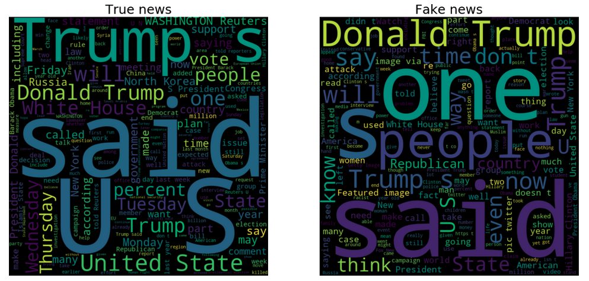

Fake news detection
==============================

With all the available technology and access to the internet information is easily accessible everywhere. This can also have negative impacts, one of which being the rapid spread of disinformation through fake news.  
The aim of this project is to **provide an example of fake news detection** using several machine learning algorithms.
For training I used a dataset that can be found on [Kaggle](https://www.kaggle.com/clmentbisaillon/fake-and-real-news-dataset). It contains **23 481 fake** and **21 417 true news articles**. The great majority of true news articles have been retrieved from [reuters.com](https://www.reuters.com/). Fake news data has been collected from various unreliable websites that have been labeled as such by [Politifact](https://www.politifact.com/), a website devoted to fact-checking.  
Most of this dataset information lies in the political sphere and is mainly related to 2016 US election.

The project consists in a series of Jupyter notebooks and python scripts structured in the following way:
1. `src/data/initial_exploration.ipynb`: explores the dataset in order to obtain valuable insights that will later be used in the data cleaning and training steps
2. `src/data/data_cleaning.ipynb`: based on observations obtained in the previous step, the initial data is cleaned and prepared for training.
3. `src/training.ipynb`: uses the preprocessed data from the step before and feeds it to a series of classification algorithms: logistic regression, multinomial Naive Bayes, random forest, support vector machines. Classification reports are shown and compared

## Install
Run `pip install -r requirements.txt` to install dependencies.

